# Вопросы к экзамену

### [All books and stuff i used i believe](https://drive.google.com/drive/folders/1Iu9SkWP7momHWXes4O3O1RCm_70vUUCJ?usp=sharing)

# **Тема 1. Основные понятия и определения**

1. Процесс управления, основные понятия и определения.

   
   
   
2. Управление по отклонению, замкнутая система управления.

   
   
3. Классификация систем автоматического управления.
   
   
   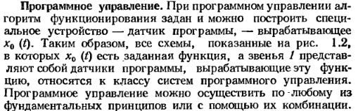
   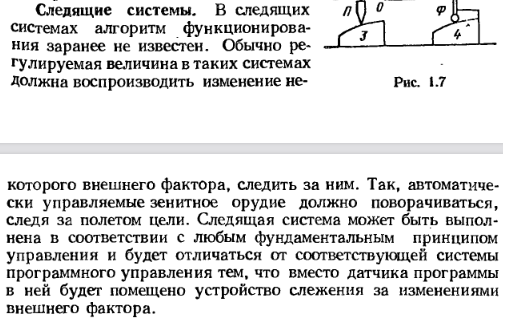
   
   
   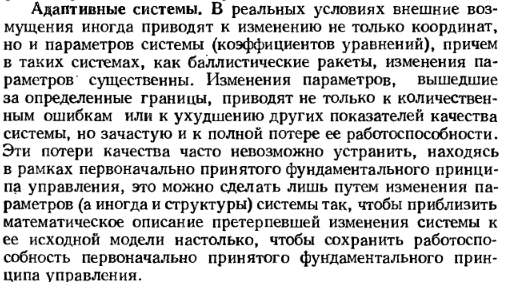
   
4. Функциональная схема системы автоматического управления.

   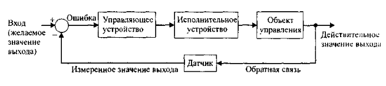

# **Тема 2. Линейные системы управления**

5.	Линеаризация уравнений и систем.

   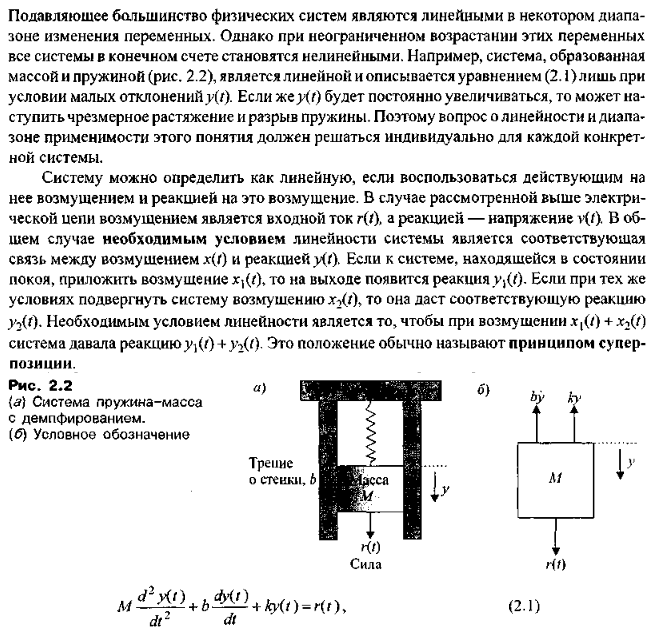
   
6.	Преобразование Лапласа и его основные свойства.

   
   
7.	Определение передаточной функции системы.

   
   
8.	Структурная схема системы, преобразование структурных схем.

   
   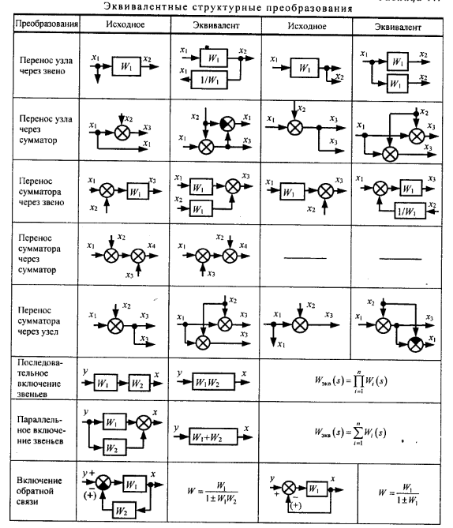
   
9.	Модели в виде сигнальных графов.

   
   
10.	Передаточные функции по управлению, по возмущению и по ошибке.

    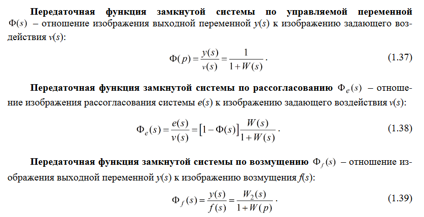
	
11.	Статические и астатические системы. Временные характеристики.

    
    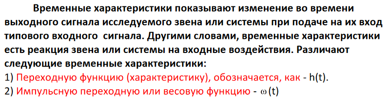
	
12.	Частотные характеристики систем и их графические представления.

    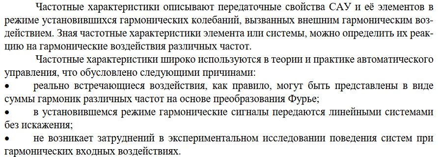
    
	
13.	Типовые звенья и их характеристики.

    

# **Тема 3. Устойчивость линейных систем**

14.	Понятие устойчивости. Принцип аргумента.

    
    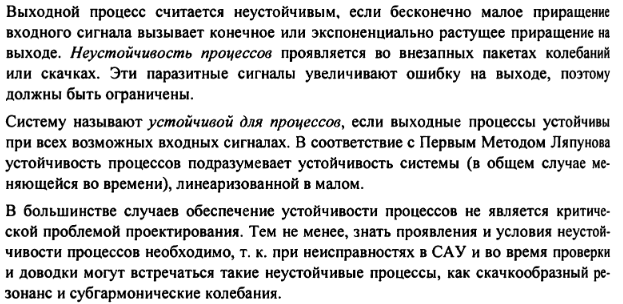
    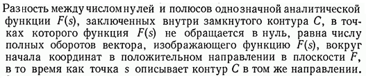
	
15.	Частотные критерии Найквиста и Михайлова. Построение областей устойчивости.

    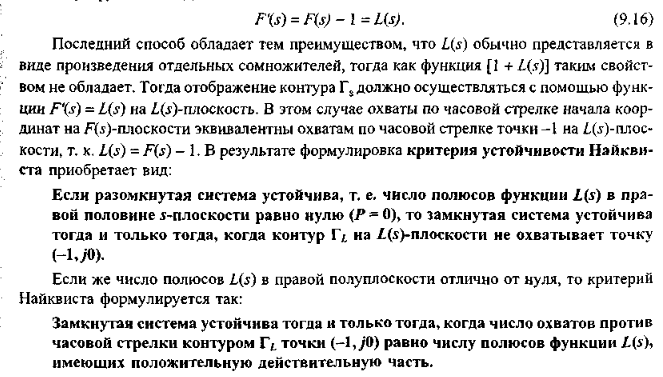
    
    
	
16.	Анализ устойчивости по логарифмическим характеристикам. Запасы устойчивости.

    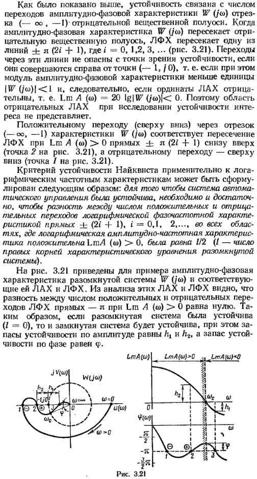
    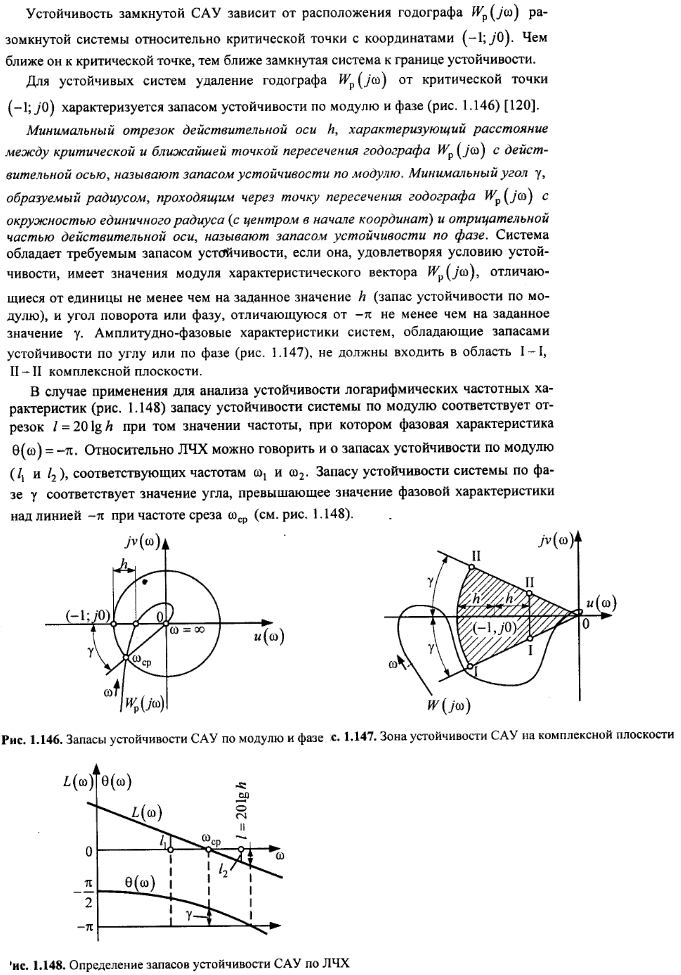
	
17.	Алгебраический критерий Рауса-Гурвица.

    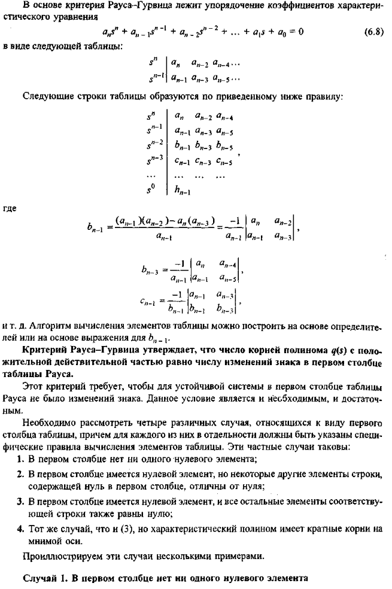

# **Тема 4. Показатели качества систем управления**

18.	Коэффициенты ошибок. Прямые показатели качества переходного процесса.

    
    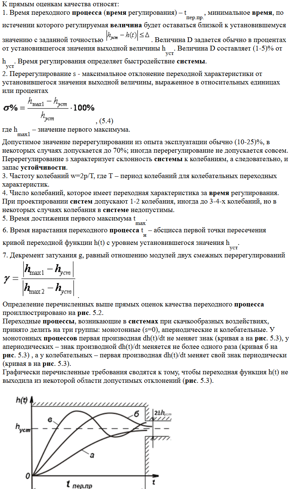
	
19.	Частотные, корневые и интегральные оценки качества.

    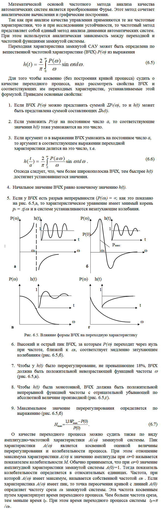
    
    

# **Тема 5. Анализ дискретных систем**

20.	Цифровые системы управления.

    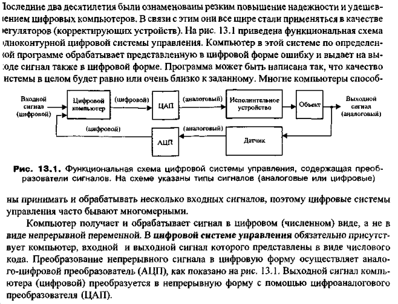
	
21.	Уравнения в конечных разностях. Z-передаточные функции.

    
    
    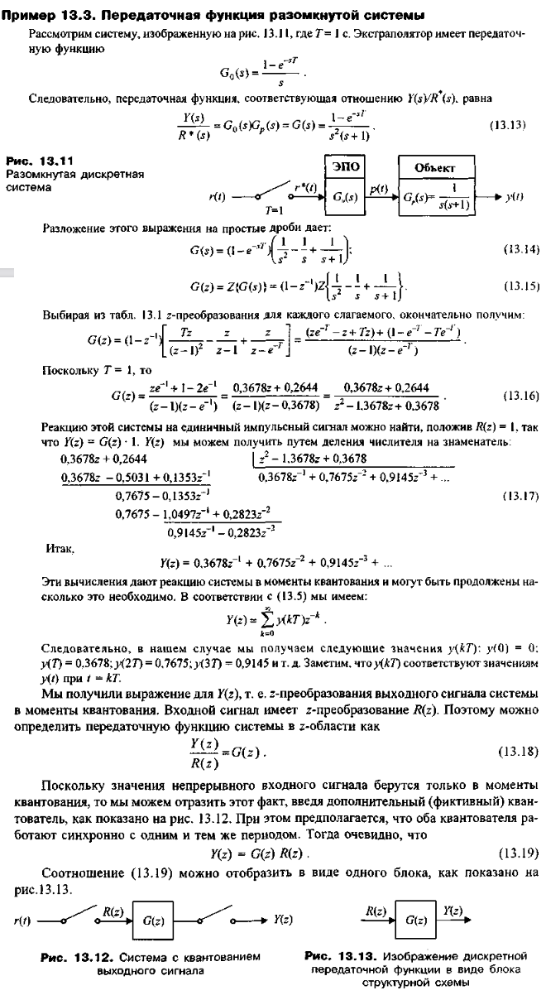
	
22.	Устойчивость дискретных систем: условие устойчивости дискретной системы; w-преобразование; аналог критерия Рауса-Гурвица.

    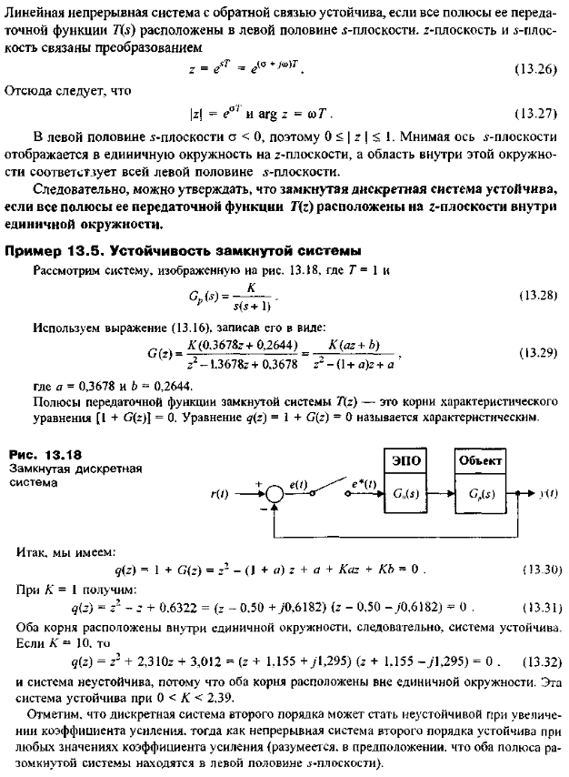
    
    

# **Тема 6. Нелинейные системы управления**

23.	Нелинейные системы управления. 

    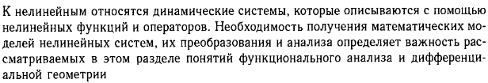
	
24.	Типовые нелинейности.

    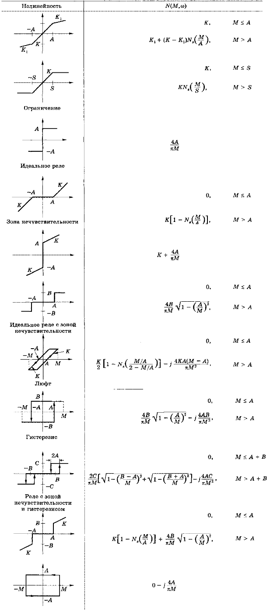

# **Тема 7. Моделирование систем управления с помощью Matlab**

25.	Передаточные функции и структурные схемы в MATLAB.

    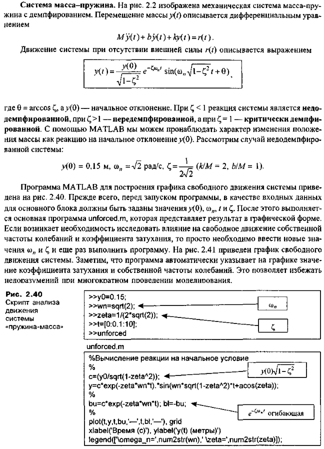
    
    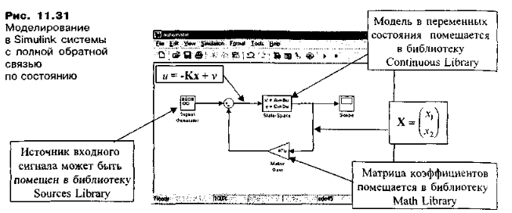
	
26.	Определение характеристик систем управления с помощью MATLAB.

    