# Вопросы к экзамену.

1. Spectral power density of the random process

   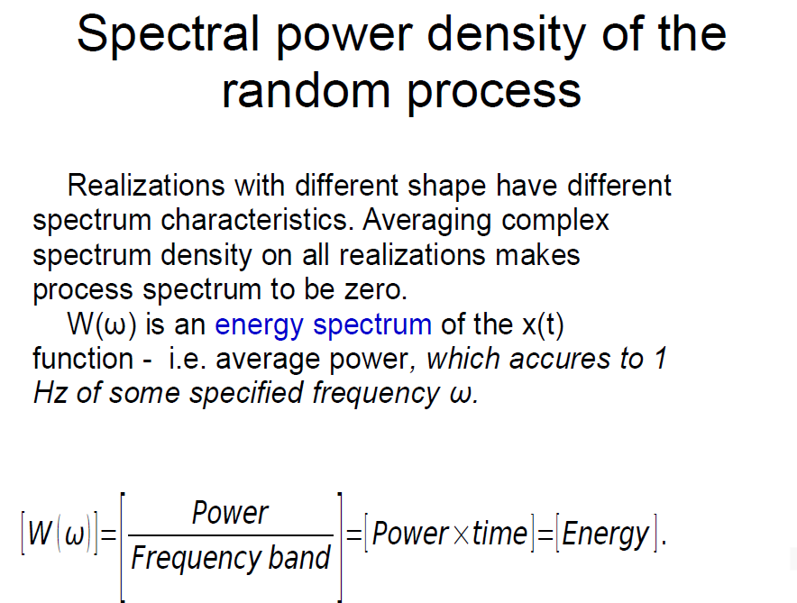

2. Quasi determinated signals – signal model

   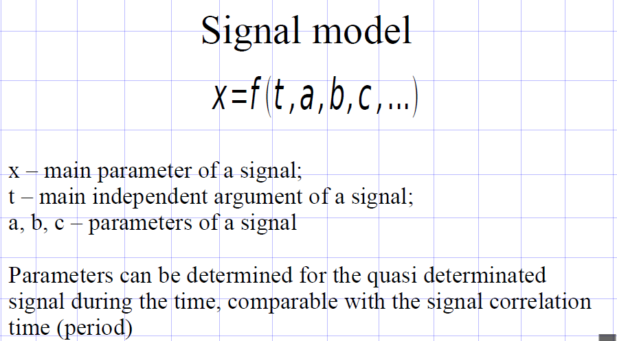

3. Complex quasi determinated signals

   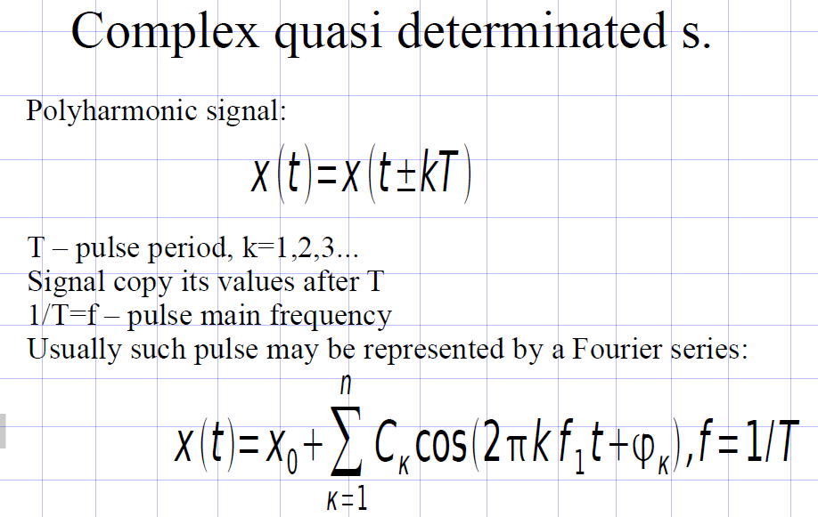

4. Transmission efficiency 

   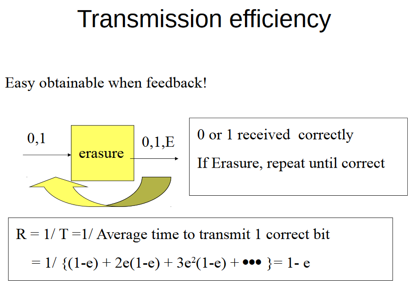

5. Random process parameters

   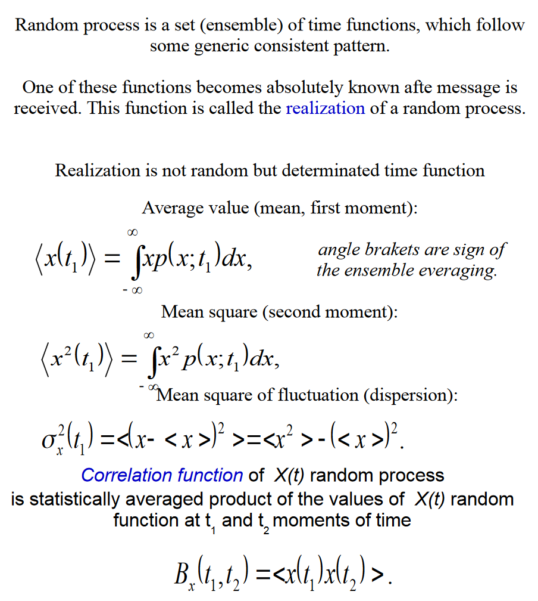

6. Process ergodity

   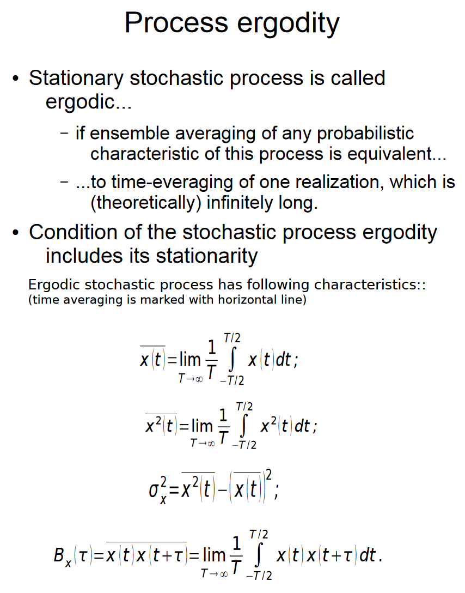

7. Model for a Communication System

   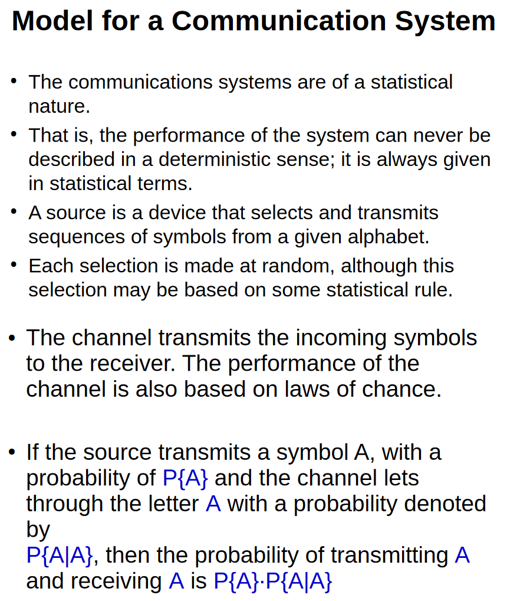

8. Signal transfer

   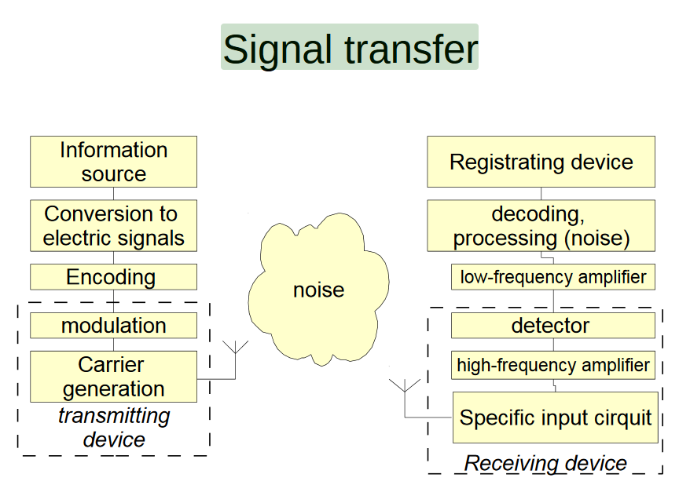

9. Basic idea of cryptography

   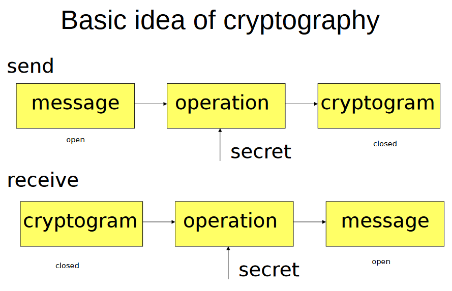

10. Types of signals 

    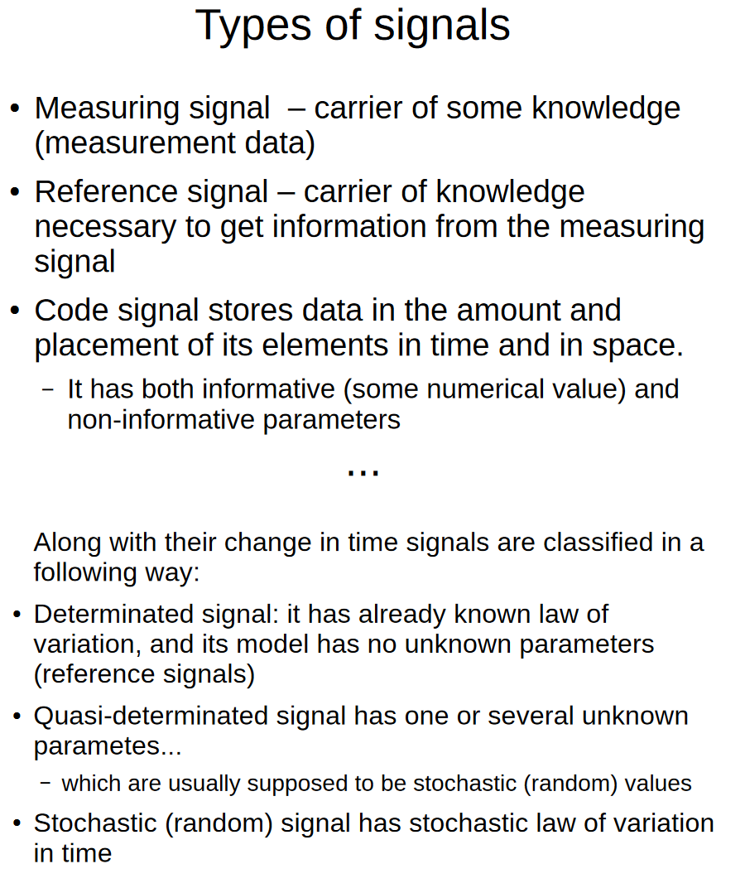

11. Specifics of the information and properties 

    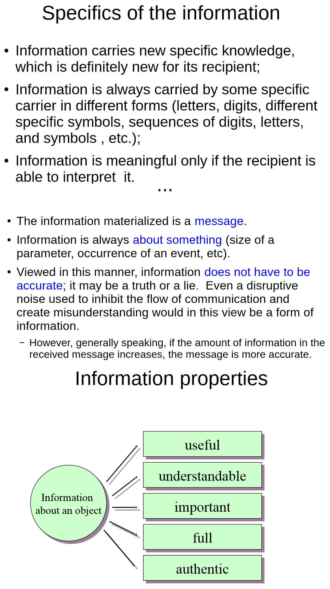

12. «Measuring» information

    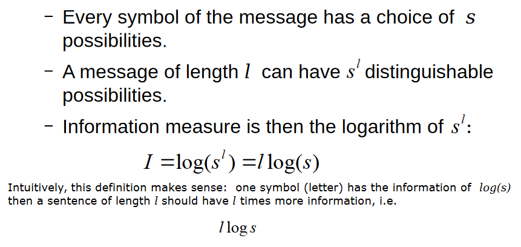

13. Signal spectrums

    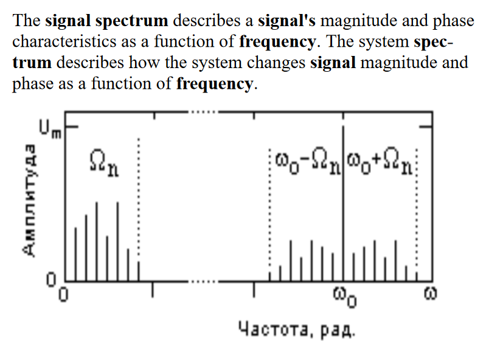

14. Pulse-modulated signals

    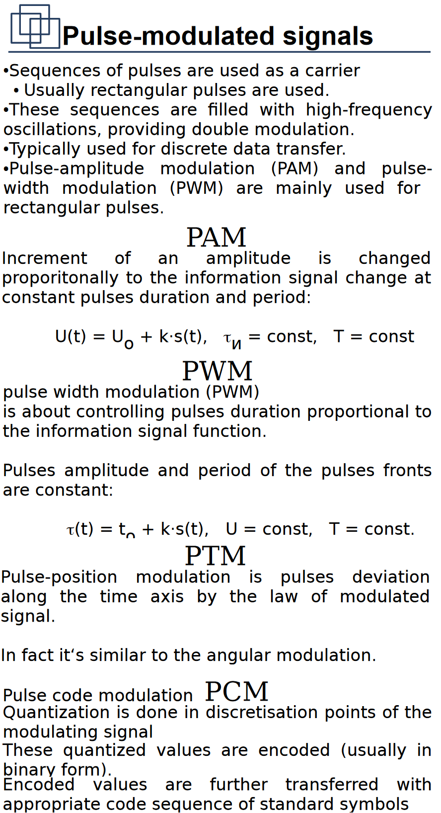

15. Classification of signals

    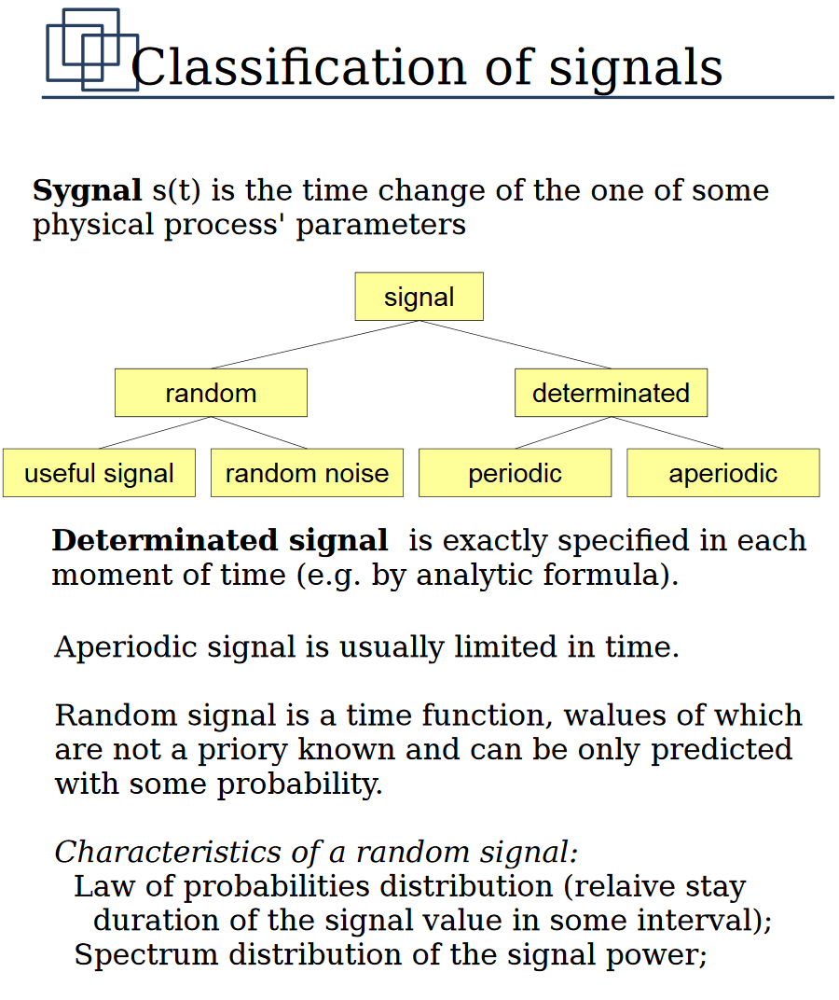

16. Amplitude modulation.

    

17. Symbolic and code data modulation

    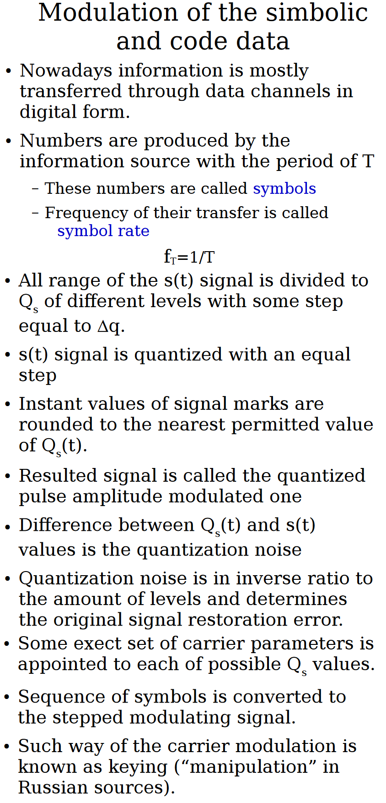

18. Angular modulation

    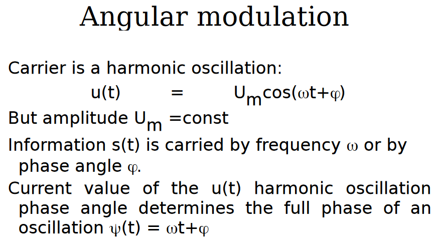